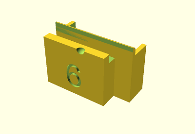
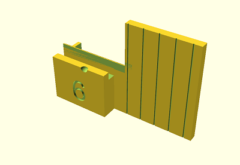
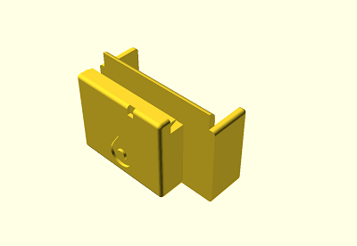

# LishiKeyCuttingGuides - Generation toolkit

**NOTE: This is in development, I'll remove this banner once I've confirmed the geometry is absolutely correct.**

This is a version of Deviant and Tony's [original
work](https://github.com/deviantollam/LishiKeyCuttingGuides) that is focussed
on:

 - Providing a toolkit for generating guides for other formats
 - More forgiving geometry for cheaper 3D printers
 - An optional "wide" mode including a guide to help locate the shoulder for each pin

The original repository's README is included [below](#the-original-readme),
for more context and attribution, and I've kept their original reference STLs
for Schlage in the [references](references/) subfolder, along with the Schlage
marker sleeve for pin positions.

## Images

These two images are the default and wide-mode generated versions (for 6-pin
Schlage, as above):

 

And this is an example of the original reference STLs:

## Generating guides

### Windows

The script `generate.bat` is used to create the guides, into the
[generated](generated/) subfolder. I've put a few of them in there for
reference.

As per the variable at the top of the file, the script expects OpenSCAD to be
installed in `C:\Program Files\OpenSCAD\openscad.exe`, update that as you
need.

Run it with arguments `generate.bat Schlage 8.509 0.381 5.86 10 0` where:

 - `Schlage` is the key name/label for output files etc.
 - `8.509` is the zero cut height, in mm.
 - `0.381` is the size of each step in depth, in mm.
 - `5.86` is the distance from pin 1 to the shoulder, in mm.
 - `10` is the total number of possible depths, including the zero cut.
 - `0` is the numeric code for the zero cut.

The above numbers will generate 9 guides for Schlage, which I've done into the
[generated](generated/) folder. The zero cut is not generated because it's
very hard to correctly cut.

If you append the arguments `wide 3.96 6` at the end of the parameters, it
will add enough indents to help you align cuts for 6 pins without using the
[Schlage Marker Sleeve.stl](references/Schlage%20Key%20Marker%20Sleeve.stl)
(the spacing will be 3.96mm, for Schlage). This does compromise how compact
the guides are, but may work for your use case. I've included the output of
`generate.bat Schlage 8.509 0.381 5.86 10 0 wide 3.96 6` into the same
[generated](generated/) folder.

### Linux

As above, but with ./generate.sh ...

## TODOs

 - [ ] Finger hook to remove?
 - [ ] Horizontal cut to help keep key aligned with pin 6 etc?
 - [ ] Set file name to match depth code, instead of zero-based depth index.

## Known good configurations

 - Schlage: `Schlage left 8.509 0.381 5.86 10 0` + `wide 3.96 6`
 - Kwikset: `Kwikset left 8.8 0.59 6.27 8 1` + `wide 3.81 6`
 - Lockwood: `Lockwood right 8.509 0.381 5.86 10 0` + `wide 3.96 6`

## The original README

3D printable files for the ersatz Pak-A-Punch developed by Deviant and Tony of 3D Locksport

To those who do not know of the history of the Pak-A-Punch, by the way... that tool was the brainchild of Ricky Lee King (and his collaborator Rob Robinson, both from Richmond, VA) who was the main individual behind A-1 Security Manufacturing.  With multiple patents to his name, his contribution to the locksmithing world was immense and his passing leaves a significant void in our industry.  When Mr. King passed away, the A-1 company appeared to die along with him.  Thus, the Pak-A-Punch is no longer available.

A number of improvised and ersatz hacks to replace it have been kludged together in the past, but here at Red Team Tools we wanted to offer something a bit more robust and functional than what's been put out there in the past.  None of us could likely ever replace the Pak-A-Punch, but this small set of guides that attach to the Lishi Key Cutter helps us come close, perhaps!

By attaching these printed guide blocks to the front end of a pair of Lishi Key Nipper Pliers (also sold here on Red Team Tools) you can make calibrated cuts to your key blade at the proper manufacturer bitting depths for Schlage systems.  (It is nearly impossible to make an accurate 0-depth cut on a key blade using Lishi Nippers so we recommend that users start with 0-bitted, pre-scored key blanks during this process.  Such keys will also help to ensure that your cuts are made at the proper position laterally along the blade.)

Additional description and demonstration of the use of these Key Cutter Guides can be seen in this video here...

 https://www.youtube.com/watch?v=MVNUbwL26H4

Many thanks to Tony Virelli for his help with bringing this design to life and getting the first prints made while we tested and refined this product
